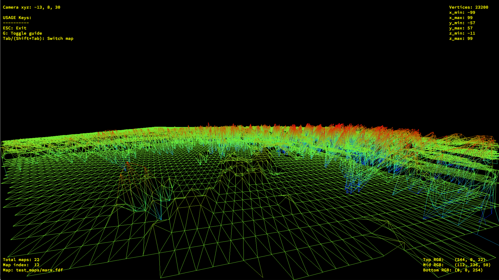

# FDF (Wireframe)
A wireframe modeling of 3D landscapes. Hive's (School 42) introduction assignment to computer graphics. (See assignment_brief.en.pdf).

Due to norm limitations (only `exit`, `open`, `close`, `write`, `read`, `malloc`, `free`, and the functions of `minilibx (libmlx)` and `math.h`), Libmatrix was written for this project. Libft was an earlier school assingment (standard c functions + own extras).


# Run
```
git clone git@github.com:hakolao/ft_wireframe.git && cd ft_wireframe
make
./fdf test_maps/*
```


# Features
- Input handling with guiding errors
	- See example valid files in `test_maps`, invalid files in `test_maps_invalid`
	- Errors (Could be more usable, but they'll have to do for now):
	```
	No such file or directory
	Input/output error: Zero on a row length found
	Input/output error: Empty x or y in map data
	Input/output error: Length of row must be same on each row
	Input/output error: Lines must consist of spaces & (+/-)numbers
	Input/output error: Error reading map: test_maps_invalid/empty.fdf
	```
- FPS camera with WASD & mouse movement
- Rotation of map
- Perspective options (Orthographic & Perspective)
- Map scaling
- Reset map to original state
- Colors with gradient based on vertex height (z)
- Change colors & background
- Bresenham line drawing
- View multiple maps
- Pivoting map to 0, 0, 0
- Showing real-time coordinates of map corners
- Toggleable guide & Realtime info on map & camera
- Real-time color info (Top, Mid, Bottom)



# Gradient
Coloring is based on below functions

- `map->col_r` is high closer to high z, low everywhere else
- `map->col_g` is high cose to zero z, low everywhere else
- `map->col_b` is high close to low z, low everywhere else

This generates a typical heightmap looking coloring.

```c
double			height_multiplier(t_vector *point, t_map *map)
{
	double in_minmax[2];
	double out_minmax[2];

	in_minmax[0] = map->z_min - 0.1;
	in_minmax[1] = map->z_max + 0.1;
	out_minmax[0] = -M_PI / 2;
	out_minmax[1] = M_PI / 2;
	return (ft_lmap_double(point->v[2], in_minmax, out_minmax));
}

int				map_color(t_vector *point, t_scene *scene)
{
	t_map	*map;
	double	mul;

	map = scene->maps[scene->map_index];
	mul = height_multiplier(point, map);
	return (COLOR(
		(int)(0.5 * (1 + sin((2 * mul - M_PI / 4) / 2)) * map->col_r),
		(int)(cos(mul) * cos(mul) * map->col_g),
		(int)(0.5 * (1 + cos((mul + M_PI / 2) * 1.2)) * map->col_b),
		map->col_a));
}
```


# Usage
```
ESC: Exit
G: Toggle guide
Tab/(Shift+Tab): Switch map
Left: Rotate map y-
Right: Rotate map y+
Up: Rotate map x+
Down: Rotate map x-
W: Move forward
S: Move backwards
A: Strafe left
D: Strafe right
Q: Rotate map z-
E: Rotate map z+
C: Loop map color
B: Loop bg color
P: Loop perspective
R: Reset
O: Show coords
1: zoom -
2: zoom +
Num 4: Turn left
Num 6: Turn right
Num 8: Turn up
Num 2: Turn down
Num +: Scale map up
Num -: Scale map down
Scroll up: Scale map z up
Scroll down: Scale map z down
Hold left mouse & move: Rotate camera
Hold right mouse & move: Rotate map
```

# Notes
- Code follow's 42's strict norms:
- Functions must not exceed 25 lines
- Max 5 functions in a .c file
- Cannot stick variable declaration and initialization on the same line
- Max 5 variables per block
- Max 4 parameters per function
- Forbidden keywords: `for`,  `do ... while`, `switch`, `case`, `goto`

